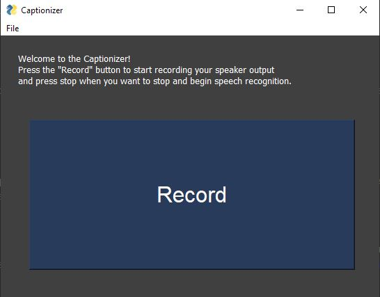
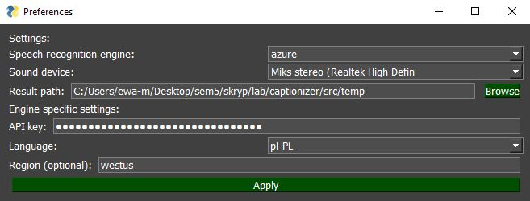
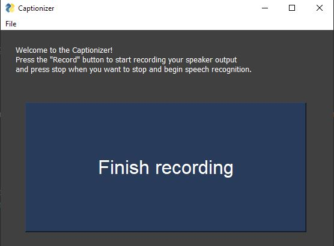
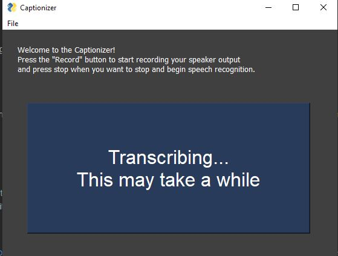
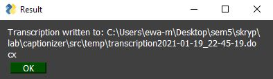

# Captionizer

Captionizer enables to create transcriptions of lectures, online meetings or videos in the docx format. 
It can capture sounds from any audio input, or speakers output (stereo mix). 
2 speech recognition engines are supported (Google and Azure).

## Tests and accuracy

The app is intended to transcribe lectures and other mostly single-speaker content, so such examples were chosen for tests.
The Azure engine performs much better than the Google one, so I will use it for the most part.
Mistake ratio is described as: (wrong words + 0.5 * correct words, but in a wrong form) / all words.
Punctuation accuracy is not measured, although it's worth noting, that only Azure engine provides it 
(it has a solid accuracy in English, and acceptable in Polish)

AZURE / ENG:

- Easy: [World politics, Yale University lecture](https://youtu.be/BDqvzFY72mg?t=717) - 11:58-14:28 - see 
  [transcription fragment](https://github.com/MaciejMarkiewicz/captionizer/tree/master/src/examples/eng-azure.docx) - 0% mistakes -
  perfectly transcribed and with perfect (reflecting speaker's intention) punctuation
- Harder: [Youtube vlog, history of Nutella](https://www.youtube.com/watch?v=539ynhsbboY?t=72) - 1:12-2:42 - see 
  [transcription fragment](https://github.com/MaciejMarkiewicz/captionizer/tree/master/src/examples/eng-azure-2.docx) - 1% mistakes -
  mostly small mistakes, video dynamics is not captured in punctuation, but it's ok in general

AZURE / PL

- Easy: [Prof. Jerzy Bralczyk: "Jak mówić, żeby nas słuchano"](https://youtu.be/TG4ZAGnlPOY?t=775) - 12:56-14:10 - see 
  [transcription fragment](https://github.com/MaciejMarkiewicz/captionizer/tree/master/src/examples/pl-azure.docx) - 4% mistakes -
  mostly small, understandable mistakes, one serious - punctuation is not great, but still better, than plain text
- Harder: [Travel vlog, Rio Grande, Argentina](https://youtu.be/TaHGtd1WC7A?t=523) - 8:46-10:40 - see 
  [transcription fragment](https://github.com/MaciejMarkiewicz/captionizer/tree/master/src/examples/pl-azure-2.docx) - 6% mistakes -
  it's a non-scripted video, very spontaneous, so that was a really hard task - due to punctuation issues the transcription requires
  a little more effort to understand, but the accuracy is fairly good

GOOGLE / ENG
- [World politics, Yale University lecture](https://youtu.be/BDqvzFY72mg?t=717) - 11:58-12:25 - see 
  [transcription fragment](https://github.com/MaciejMarkiewicz/captionizer/tree/master/src/examples/eng-google.docx) - 9% mistakes - 
  perfect for the most part, high mistake ratio due to one missing expression in the end (was probably classified as mumbling)

GOOGLE / PL

- [Prof. Jerzy Bralczyk: "Jak mówić, żeby nas słuchano"](https://youtu.be/TG4ZAGnlPOY?t=775) - 12:56-13:22 - see 
  [transcription fragment](https://github.com/MaciejMarkiewicz/captionizer/tree/master/src/examples/pl-azure.docx) - 5% mistakes -
  surprisingly good, mistakes are understandable

## Usage & UI

- Install all dependencies - `pip install -r reguirements.txt`
- Enable stereo mix in Windows -> right click on the sound icon on the taskbar -> sounds -> recording -> stereo mix -> enable
- Get an api key for azure cognitive services (preferred) or google speech api (you can use the default google key, but it is very limited). 
  Be aware that changing your default recording device might result in changing your current online meeting software default settings.
- Run the app:

- Go to preferences and set the engine, key and language. Set stereo mix as the input device, if you want to transcribe the sounds you hear:

- Press record to start recording
- Press "Finish recording" to stop:
  

- Wait until transcription process finishes:

- Transcription is stored to the specified path:
  

